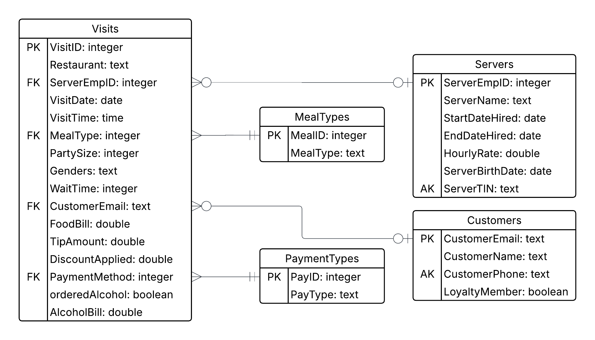

##### Course Name: CS5200 - Database Management
##### Semester: Summer 2025

## Functional Dependencies

**- For the relation represented by all of the columns in the CSV file, define all functional dependencies and list them.**

\begin{align*}
\textbf{VisitID } \rightarrow &\text{ Restaurant, ServerEmpID, ServerName, StartDateHired, EndDateHired,}\\
&\text{ HourlyRate, ServerBirthDate, ServerTIN, VisitDate, VisitTime, MealType,}\\
&\text{ PartySize, Genders, WaitTime, CustomerName, CustomerPhone,}\\
&\text{ CustomerEmail, LoyaltyMember, FoodBill, TipAmount, DiscountApplied,}\\
&\text{ PaymentMethod, orderedAlcohol, AlcoholBill}\\\\
\textbf{ServerEmpID } \rightarrow &\text{ ServerName, StartDateHired, EndDateHired, HourlyRate, ServerBirthDate, ServerTIN}\\\\
\textbf{CustomerEmail } \rightarrow &\text{ CustomerName, CustomerPhone, LoyaltyMember}
\end{align*}

Based on the above functional dependencies, the VisitID uniquely identifies all the other attributes, ServerEmpID uniquely identifies server information, and CustomerEmail uniquely identifies customer information.

## Relations in 3NF

**- Using the functional dependencies and the rules of normalization, decompose the relational from the CSV into several relations that all satisfy 3NF; give the relations reasonable names.**

In order to normalize the relation to 3NF, the relation must be broken into 3 separate tables to avoid transitive dependencies.

\begin{align*}
\textbf{Visits} \text{ (} &\text{VisitID, Restaurant, ServerEmpID, VisitDate, VisitTime, MealType}\\
&\text{PartySize, Genders, WaitTime, CustomerEmail, FoodBill, TipAmount,}\\
&\text{DiscountApplied, PaymentMethod, orderedAlcohol, AlcoholBill)}\\
\text{Primary Key: } &\textbf{VisitID}\\\\
\textbf{Servers} \text{ (} &\text{ServerEmpID, ServerName, StartDateHired, EndDateHired, HourlyRate, ServerBirthDate, ServerTIN)}\\
\text{Primary Key: } &\textbf{ServerEmpID}\\
\text{Alternate Key: } &\text{ServerTIN}\\\\
\textbf{Customers} \text{ (} &\text{CustomerEmail, CustomerName, CustomerPhone, LoyaltyMember)}\\
\text{Primary Key: } &\textbf{CustomerEmail}\\
\text{Alternate Key: } &\text{CustomerPhone}
\end{align*}

## Entity-Relationship Diagram (in Crow's Feet notation)

**- For the relations resulting from the normalization, create an ERD in the IE (Crow's Feet) notation. Add all attributes, attribute name, primary and foreign keys, data types, and entity descriptions.**

Based on the data in the CSV file, the server and customer information can be NULL (a visit does not necessarily need to have a customer or server info), so the cardinality has been set accordingly.

**Visits**

Represents visits to restaurants and records info regarding each of the visits

**Servers**

Represents servers at the restaurants

**Customers**

Represents customers at the restaurants

**Meal Types**

Lookup table for classifying visit types by meal (Breakfast, Lunch, Dinner, Take-out)

**Payment Types**

Lookup table for classifying visit types by payment methods (Credit card, Mobile Payment, Cash)